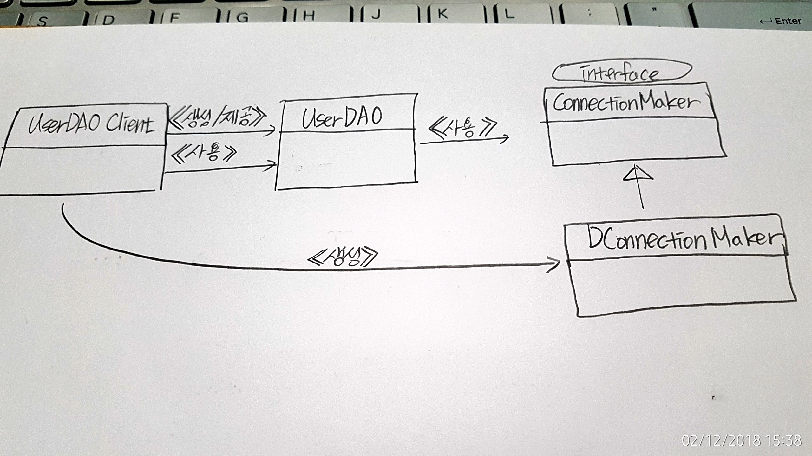

# DI (Dependency Injection), 의존성 주입

### DI Refactoring 1
__설명__

Main.java에서 User Class의 객체를 만들고 해당 객체에 대해 멤버변수들을 초기화해주었다. 그리고 해당 객체의 내용값들을 데이터베이스에 연결해 저장시켜주었다. UserDAO 클래스는 데이터베이스와 연결하는 동일한 내용들에 관해서 중복된 코드를 가지고 있다. 커넥션과 연결하고 이후에 preparedStatement를 통해서 쿼리문을 작성하고 값을 삽입하고 데이터를 조회하는 등의 내용들이 있다. __분리와 확장__

__문제__

해당 코드에서는 대규모 사용자가 들어왔을 경우에 메인스레드에 값을 집어넣어야 한다. 하지만 커넥션 객체가 변경되는 경우 UserDAO를 수정해주어야 하는데, 이때 영향을 끼치는 클래스들의 범위를 좁혀야 한다. __분리와 확장__

-----

### DI Refactoring 2
__설명__

앞선 코드에서 해당 유저 테이블에 대한 내용값은 동일하다. UserDAO 클래스에서 데이터베이스와 연결하는 동일한 내용 즉, Class.forName()과 Connection conn = DriverManager.getConnection(""); 쪽 코드를 하나의 메소드로 구현해서 해당 메소드를 중복해서 쓰지 않아도 된다.

__문제__

분리와 확장을 통해서 해당 내용들을 개선해나가고 수정해나갈수 있다.

-----

### DI Refactoring 3
__설명__

이전 단계, 같은 클래스에 다른 메소드로 분리되었던 DB 커넥션 연결에 대해서 상속을 통해 서브클래스로 분리하였다. 해당 클래스는 즉, UserDAO가 다른 클래스를 상속하고 있다면 다른 목적으로 UserDAO를 상속하기 어려워진다. __다른 추상메소드__ 를 모두 오버라이딩 해야하기 때문이다. 필요하지도 않은 기능들을 모두 오버라이딩 한다면 해당 클래스에게 실용적이지 않은 책임을 많이 떠안게 되는 문제가 된다.

_템플릿 메소드_
슈퍼클래스에 기본적인 로직의 흐름을 만들고, 그 기능의 일부를 추상메소드 혹은 오버라이딩 가능한 protected 메소드 등으로 만든 뒤, 서브 클래스에서 이런 메소드를 필요에 맞게 구현한 것이다.
 
 -----
 
### DI Refactoring 4
__설명__
이전 단계 DI Refactoring 3 에서 UserDAO 클래스의 DB Connection을 가지고 오는 메소드를 하나의 클래스 SimpleConnectionMaker인 독립 클래스로 만들어주었다. (상속관계가 아니다.)
SimpleConnectionMaker 클래스를 살펴보게 되면, 앞선 DI Refactoring 3 에서 두 개의 커넥션에 연결할 메소드를 두 개의 형태로 나누어주어야 한다. 하지만 DB 커넥션의 객체가 여러 개라면 모든 메소드를 하나하나 작업해주어야 한다. 이때 해결할 수 있는 방법이 바로 __인터페이스__ 이다.

-----

### DI Refactoring 5
__설명__
현재까지 Main 클래스와 User 클래스는 건드리지 않았다. 계속해서 DB Connection 관련한 코드만 리팩토링을 수행하고 있을 뿐이다.
UserDAO 클래스 내에 있는 모든 코드들을 __주석처리__ 하였고, 생성자로 초기에 한번 어떤 DB Connection 을 사용할 지 결정한다. D사 커넥션과 N사 커넥션, 두 개의 클래스를 만들어서 해당 오브젝트로 데이터베이스에 접근하려고 하려고 한다. 

ConnectionMaker는 인터페이스로 구현되어서 N사 커넥션 클래스와 D사 커넥션 클래스가 서로 느슨하게 연결될 수 있도록 하였다. 이것이 인터페이스의 장점이다. __DB커넥션을 N사 그리고 D사 대해서 각각의 객체를 만들 필요 없이__ __인터페이스 구현체__ 하나로 N사 그리고 D사에 대한 DB 커넥션 객체를 호출할 수 있다. 이것은 자바 객체지향의 큰 특징인 __다형성__ 의 원리를 이용한 것이라고 볼 수 있다.

-----

### DI Refactoring 6
__설명__
UserDAOClient 클래스를 만들고, 해당 클래스가 DB 커넥션에 대한 책임을 가지게 하였다. 그리고 UserDAO는 그 책임에서 분리시켰다. UserDAOClient에서 UserDAO가 사용할 ConnectionMaker 구현 클래스를 결정할 수 있도록 하였다. 그리고 ConnectionMaker는 앞서서 말했다시피 인터페이스로 구현되어서 객체간의 결합을 느슨하게 해주었다.

